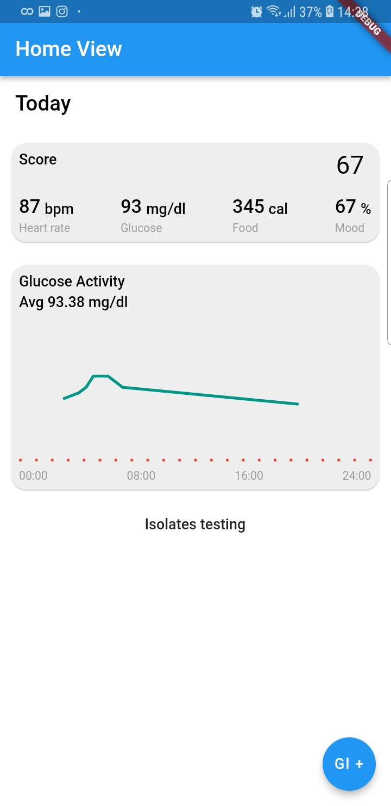
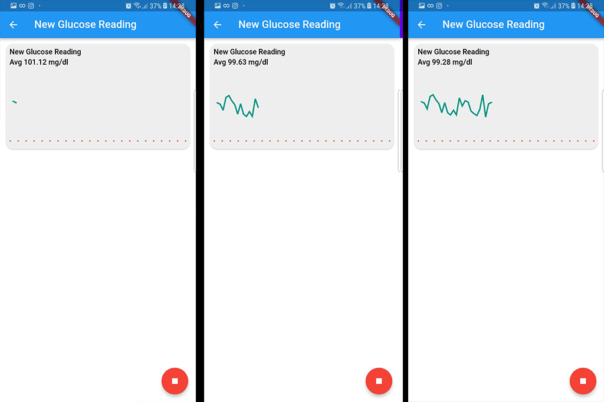
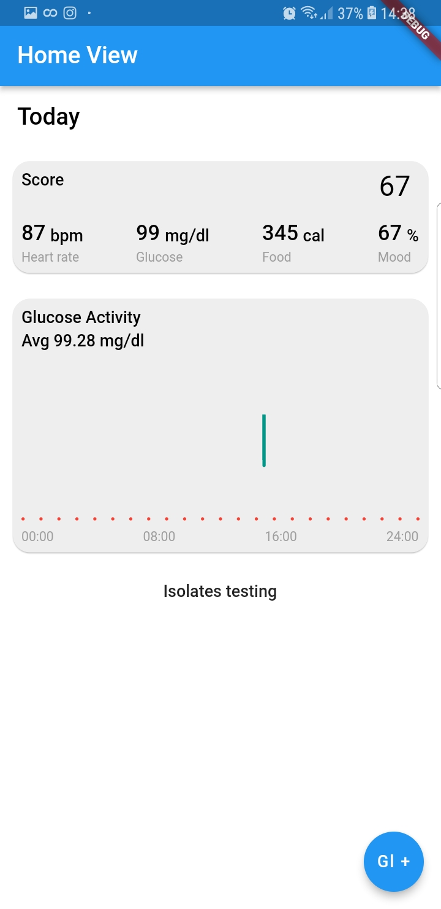

# lab_coffee

A quick prototype on CLEAN Architecture and custom graphs made in/for Flutter :)

The first screen shows data coming from the net (mocked)
As soon as the data are received are stored locally and on app restart the local/cached
data are shown.

Tapping on the bottom right Floating Action Bar, takes us to the new reading screen,
where a glucose reading service is started as soon as the screen is shown (mocked).

Tapping back, cancels the new reading and the user shows their previous data.

Instead, tapping on the stop floating action bar, the new reading is saved on the local
data source and moving back to the home screen the user sees the new data.

The graph seems broken, but this is actually correct, as the home page graph is setup to show 24 hour
data and our new reading was just a few seconds.

In a real app, the repository and data source would provide for far more functionality, such as
adding new data sets, appending to existing data and so on. At the moment the data source and repository
simply provide for loading of all data and saving/overriding old data.

The graph used in the live reading page, is the same one used in the home page but set to a far smaller
time range (in the x-axis), that of one minute.

More info coming soon..